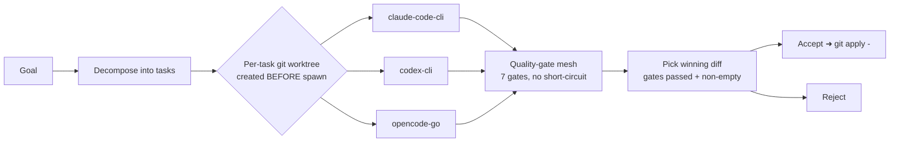

<p align="center">

# 🜂 Apohara Catalyst

**A Rust-native, local-first orchestrator that races the AI coding CLIs you already pay for — in parallel, in isolated git worktrees, consuming zero extra tokens of its own.**

</p>

<p align="center">
  
  
  
  
  
  
  
</p>

---

> In chemistry, a **catalyst dramatically lowers the activation energy of a reaction without being consumed.**
> Apohara Catalyst does the same to your engineering work: it lowers **Time-To-First-Token** by dispatching a goal across Claude Code, Codex, and OpenCode *simultaneously* — while burning **zero tokens of its own**. The name fuses the chemical catalyst with the LLM **TTFT** metric.

<!-- Honesty note: the "lowers Time-To-First-Token" line above is the aspirational
     product tagline, not a measured metric. No TTFT speedup percentage is claimed
     anywhere (see "Status & scope") because none has been measured. -->


## What & why

You already pay for one or more AI coding CLIs. Today you run them one at a time, babysit them, and hope the first answer is the good one.

**Apohara Catalyst sits between you and your CLIs.** You type a goal; it dispatches the three CLIs you already have in parallel — each in its own isolated git worktree — runs every result through a quality-gate verification mesh, and surfaces only the **winning diff** for a one-click Accept (a real `git apply`). It adds no tokens, opens no OAuth flow, phones no home. It is a single native Rust binary on your machine.

---

## ⚙️ How it works

```
        ┌──────────────────────────────────────────────────────────────┐
        │                  you type a goal  ➜  press Run                 │
        └──────────────────────────────────────────────────────────────┘
                                     │
                          decompose into role-fit tasks
                                     │
        ┌────────────────────────────┼────────────────────────────┐
        │ git worktree #1            │ git worktree #2            │ git worktree #3
        ▼                            ▼                            ▼
   claude-code-cli                codex-cli                  opencode-go
   (Implement/Debug/Test)         (Refactor)                 (Document)
        │  stdout stream              │  stdout stream            │  stdout stream
        ▼                            ▼                            ▼
        └──────── each worktree diff ➜ quality-gate mesh (7 gates) ──────┘
                                     │
                       pick the gate-WINNING diff
                                     │
                  ┌──────────────────┴──────────────────┐
                  │  CodeDiffPane: provider badge +      │
                  │  files changed + unified diff        │
                  │   [ Accept (git apply) ]  [ Reject ] │
                  └──────────────────────────────────────┘
```

> The role→provider routing shown above is the opt-in **smart router** (`APOHARA_SMART_ROUTER=1`); by default each task fans out to all installed CLIs.



Every provider runs through the same Rust crates — `apohara_dispatch::api::list_active_providers`, `CliDriver`, `apohara_worktree::lifecycle`, and `apohara_verification::run_all_gates` — whether you drive it from the desktop, the TUI, or the CLI. One engine, three surfaces.

---

## ✨ Why it's different

| | Typical AI orchestrator | **Apohara Catalyst** |
|---|---|---|
| **UI stack** | Electron / Tauri + React webview | **Native Rust** — Dioxus 0.7 desktop (`lto + strip + panic=abort`), no Node, no webview, no localhost server |
| **Token cost** | Adds its own model calls / API key | **Zero extra tokens** — pure stdin/stdout CLI wrappers |
| **Auth** | OAuth flows, stores tokens | **Zero OAuth, by hard design rule** — wraps CLIs you're already logged into |
| **Code search** | External vector DB or hosted embeddings | **In-process** tree-sitter + sqlite-vec + blake3 feature-hashing — no model download, ~0 resident RAM |
| **Isolation** | File locks / shared branch | **Per-task git worktree created before spawn**, with recovery-branch rescue on failure |
| **Conflict handling** | Coarse file-level locks | **Semantic** (file, symbol, kind) read/write/rename matrix with rename-dominance |
| **Sandbox** | Shell-out to `firejail` / `bwrap`, or none | **seccomp-bpf** allowlist (fail-closed `EPERM`) + user/mount/PID namespaces, all Rust-native |
| **Secrets** | `.env` / plaintext config | **OS keyring** (`keyring` 3.6) + zeroizing `SecretString` + env sanitization on every spawn |
| **Discipline** | Ad-hoc | Cross-cutting **spec §0 disciplines** + a documented *Past Incidents* ledger (each rule cites a commit + symptom) |

---

## 🔬 Highlights

<details open>
<summary><b>🛡️ A defense-in-depth safety stack — first-class crates, not afterthoughts</b></summary>

<br>

- **`apohara-sandbox` — seccomp-bpf, fail-closed, tiered.** A real BPF program compiled via `seccompiler` 0.5, with three tiers (`ReadOnly` ~45 pure-allow syscalls, `WorkspaceWrite`, `DangerFullAccess`). Unlisted syscalls return `EPERM` (recoverable, not a silent allow). `clone` is conditionally gated so all `CLONE_NEW*` namespace bits must be zero (blocks nested-userns escapes); `clone3` is denied outright. Tests actually fork a child, install the filter, and assert `write()` is `EPERM` under `ReadOnly`.
- **Unprivileged namespace isolation.** `enter_isolated_namespaces()` bundles `CLONE_NEWUSER|NEWNS|NEWPID` in one `unshare(2)` — no root, no `CAP_SYS_ADMIN` — and writes `setgroups=deny` before the uid/gid maps (kernel-required ordering). A sandboxed agent literally cannot resolve the orchestrator's PID to signal it. A double-fork PID-1 topology + 16 MiB output cap means a hostile child can't OOM the orchestrator.
- **`apohara-pathsafety` — typed symlink-escape detection.** `canonicalize_recursive` walks one hop at a time (cap = 32) and distinguishes an **attack** (`SymlinkEscape`: looks-inside-but-resolves-outside) from a **misconfig** (`EscapesRoot`), plus `SymlinkLoop`, `DanglingSymlink`, and hard-rejected `..` traversal. Runs *before* every spawn.
- **`apohara-audit` — race-free 0600 JSONL.** Append-only audit log opened with `mode(0o600)` + `O_NOFOLLOW`, then re-tightened via `libc::fchmod(fd, …)` on the live descriptor (not path-based) to close the TOCTOU swap-the-inode window. Daily + 64 MiB rotation, bounded queue, 13 `EventKind` variants including `PolicyViolation` and `SandboxBypassed`.
- **`apohara-secrets` — OS-native, zeroizing.** Wraps `keyring` 3.6 (Keychain / Credential Manager / libsecret). Returns a `SecretString` that zeroizes its heap buffer on `Drop` and whose `Debug` prints `SecretString(***)`, so an accidental `tracing::info!(?secret)` can never leak cleartext.
- **Env sanitization, two layers.** The sandbox runner's `build_sanitized_env()` uses an allowlist + a secret-stripping blocklist; the dispatch driver's spawn path does `env_clear()` then a strict 6-key allowlist (`PATH/HOME/USER/LANG/TERM/TMPDIR`) with forced `APOHARA_*` markers applied *last* so a malicious worktree `.env` can't spoof orchestrator identity or smuggle an API key.

</details>

<details>
<summary><b>🧠 An in-process semantic indexer with no model download (`apohara-indexer`)</b></summary>

<br>

- **Embeddings without a transformer.** Deterministic **blake3 feature-hashing** into a 384-dim, L2-normalized vector — signed hashing with snake_case token-splitting (so `hello_world` matches `hello world`). No `candle`, no model file, no OOM hazard, ~0 resident RAM. The code explicitly traded away a prior Nomic-BERT + redb stack to kill that hazard.
- **Storage in one SQLite file.** Code chunks + embeddings live in a `sqlite-vec` `vec0` virtual table (`embedding float[384]`); `rusqlite` is statically `bundled`. KNN is a single SQL `WHERE embedding MATCH ?1 AND k = ?2 ORDER BY distance` — no external vector DB, no network service.
- **Real structure extraction.** `tree-sitter` 0.24 (Rust + TypeScript grammars) pulls function/method/trait signatures with params and return types, plus full import/export graphs.

> Reported **unique** among mined competitors (orca, vibe-kanban, nimbalyst, multica, symphony, agentrail, chorus, culture, claude-octopus).

</details>

<details>
<summary><b>🚦 An orchestration engine that verifies before it merges</b></summary>

<br>

- **`apohara-dispatch`** — parallel CLI subprocess dispatch. Streams each child's stdout line-by-line over a bounded `mpsc(1024)` with non-blocking `try_send` (drops + warns on backpressure rather than deadlocking the child); drains stderr concurrently.
- **`apohara-worktree`** — real `git worktree add -b apohara/<slug>` with per-tree metadata + PID lock. Cleanup is preflight-gated: **dirty/unpushed/live-agent trees are never force-removed** — they're rescued onto a recovery branch `apohara/task-<id>-failed-<ts>`.
- **`apohara-coordinator`** — a semantic (file, symbol, kind) read/write/rename conflict matrix (only read-vs-read parallelizes), an indexer-confidence-gradient scheduler (`Assign`/`Queue`/`Reject`/`Defer`), and a deterministic tick loop with exponential backoff capped at 5 minutes.
- **`apohara-verification`** — a **7-gate** mesh (Architecture, Security, Perf, CodeQuality, Frontend, SysadminSafety, BashScopeGate) that runs **without short-circuit** so the critic sees the full block list. `SysadminSafety` blocks 5 dangerous shell patterns (`rm -rf /`, `curl|sudo`, `chmod 777`, raw `dd` to disk, …); `BashScopeGate` delegates to a proptest-verified compound-bash safety proof. Each block carries machine-actionable `feedback_to_agent`. Bounded to 3 rounds, escalation wins over exhaustion.
- **`apohara-token-accounting`** — process-global counters using **absolute (not delta) snapshots** so replays/reconnects stay idempotent.

</details>

<details>
<summary><b>🖥️ A genuinely native desktop (`apohara-desktop-dioxus`, the largest crate at ~7.7k LOC)</b></summary>

<br>

- **Dioxus 0.7 (`desktop`), zero web stack.** No Tauri, no wry, no React, no Electron — verified absent from its `Cargo.toml`. A single binary launched via `LaunchBuilder::desktop()`, window titled **"Apohara Catalyst"**.
- **A 3-pane CSS-grid shell** (`280px / 1fr / 360px`): an Objective pane (left), a center view that swaps **Swarm Canvas → Kanban Board → Task Board** off one signal, and a **CodeDiffPane** (right) with a provider-winner badge, files-changed list, and a line-classified unified diff.
- **Five effect-owner coroutines** mounted once: `dispatch_loop` (the heart — worktree → stream → capture diff → run gates → pick winner), `git_apply_handler` (**Accept pipes the diff into `git apply -` against your working tree**, with success/error toasts), `permission_arbitrator`, `reconciler_tick`, and `toast_reaper`.
- **Command palette** (`Cmd/Ctrl+K`, a real desktop global shortcut) with fuzzy-matched actions, plus a live token-usage statusline polling `apohara_token_accounting::api::current_totals` once a second.
- Provider cards are probed from `PATH` at startup — only CLIs actually installed render; otherwise you get a "No providers enabled." empty state.

</details>

<details>
<summary><b>🧰 A CLI + a ratatui TUI sharing the same engine</b></summary>

<br>

The `apohara` binary ships three subcommands today:
- `apohara doctor` — probes git + claude/codex/opencode on `PATH`, lists loaded crates (exit 1 on missing git, 2 on warnings).
- `apohara verify-setup [--skip-real-providers]` — 8 readiness probes across the dispatch state machine, verification mesh, safety grid, spec watcher, MCP bootstrap, hooks installer, decomposer, and projector.
- `apohara run` — single-prompt dispatch through the Rust path.

`apohara-tui` is a separate **ratatui** terminal UI. (Same crates, no JS anywhere.)

</details>

---

## 🚀 Quick start (Arch / CachyOS)

> Apohara Catalyst v1.0.0-rc.5 targets **Arch-family Linux** with a one-command `cargo install` flow. You need a Rust toolchain (`rustup`) and `git`.

```bash
git clone https://github.com/SuarezPM/Apohara-Catalyst.git apohara-catalyst
cd apohara-catalyst
bash scripts/install-arch.sh
```

The script runs `cargo install --path crates/apohara-desktop-dioxus --force`, symlinks the resulting binary to `~/.local/bin/apohara-catalyst`, warns if `~/.local/bin` isn't on your `PATH`, and installs a KDE/GNOME `.desktop` launcher (**Apohara Catalyst**, Development category) with a 256×256 icon.

**Launch it:**

```bash
apohara-catalyst              # from the terminal
```

…or pick **"Apohara Catalyst"** from your desktop application menu.

**Check your environment first (optional):**

```bash
apohara doctor                # verifies git + claude/codex/opencode on PATH
```

Make sure at least one of `claude`, `codex`, or `opencode` is installed and logged in — Catalyst dispatches whichever it finds on your `PATH`. It never sees your tokens: every spawn goes through `env_clear()` + a strict allowlist.

---

## 📐 Status & scope

`v1.0.0-rc.5` — codename **"Integrated personal Arch desktop."** This is an honest release candidate, not a 1.0.

**What it is:** a local-first, single-developer desktop orchestrator for Arch/CachyOS. One machine, one user, your CLIs, your worktrees.

**Deliberately out of scope (by design, not omission):**
- ❌ **No cloud, no telemetry-by-default, no account.** It runs entirely on your machine.
- ❌ **No OAuth, ever** — wrapping CLIs you're logged into is both a TOS and a billing-safety stance (it sidesteps the "wrong account billed" failure mode documented in our *Past Incidents*).
- ✅ **3 active providers by design:** `claude-code-cli`, `codex-cli`, `opencode-go`. Others are LEGACY behind `APOHARA_LEGACY_PROVIDERS=1`.
- ⚠️ **Cross-platform installers are wired but not yet published.** The `scripts/install.sh` one-liner (Linux/macOS, x86_64/aarch64) and the AUR/Homebrew/Scoop manifests all target the same `apohara-<triple>.{tar.gz,zip}` release assets the build matrix produces; assets publish on tag. No published release exists yet — the tag cut is a Pablo-gated manual step.
- ⚠️ **Daemon mode, SSH remote workers, smart router, and reactions ship OFF by default** and are not production-validated.
- ⚠️ The seccomp/namespace sandbox is **Linux-only** and requires `kernel.unprivileged_userns_clone=1`; on macOS/Windows it falls back to no enforcement.

We'd rather under-promise here than ship marketing numbers we can't back with code. No TTFT speedup percentage is claimed because none was measured.

---

## 🏛️ Architecture overview

The workspace is **36 Rust crates / ~43,400 lines of Rust** across 357 `.rs` files, with **1,120** `#[test]`/`#[tokio::test]` functions and **zero** non-Rust runtime packages (no `package.json` anywhere in the repo). Edition 2021, `rust-version` 1.95. Grouped by concern:

| Group | Crates |
|---|---|
| **Types & SSoT** | `apohara-types` (shared Rust↔TS via ts-rs, Intent→provider routing) · `apohara-spec` · `apohara-context-primitives` (SimHash + LSH) · `apohara-prompt-cache` |
| **Safety** | `apohara-sandbox` (seccomp-bpf + namespaces) · `apohara-safety` (permissions + bash analyzer) · `apohara-pathsafety` · `apohara-audit` · `apohara-secrets` |
| **Orchestration** | `apohara-dispatch` · `apohara-worktree` · `apohara-coordinator` · `apohara-verification` · `apohara-decomposer` · `apohara-projector` · `apohara-reaction-engine` · `apohara-attention` · `apohara-anti-thrash` · `apohara-token-accounting` |
| **Knowledge** | `apohara-indexer` (tree-sitter + sqlite-vec + blake3) |
| **Surfaces** | `apohara-desktop-dioxus` (native UI) · `apohara-tui` (ratatui) · `apohara` (CLI) |
| **Infra & MCP** | `apohara-daemon` · `apohara-client` · `apohara-transport` · `apohara-ws-hub` · `apohara-mcp` · `apohara-mcp-bridge` · `apohara-hooks` · `apohara-hooks-server` · `apohara-ssh-server` · `apohara-remote-worker` · `apohara-notifications` · `apohara-persistence` · `apohara-event-humanizer` |

> **For contributors:** before non-trivial changes, read the cross-cutting **spec §0 disciplines** and the **Past Incidents** ledger in `CLAUDE.md` — each rule cites a commit and a symptom, so the *why* survives even when the original engineer doesn't.

---

## 👨‍👩‍👧 The Apohara family

Apohara Catalyst is the **orchestrator** of a three-part family:

- **🜂 Apohara Catalyst** — multi-AI CLI orchestrator *(this repo)*
- **⚖️ Apohara Probant** — cross-AI code verifier
- **🏛️ Apohara Consilium** — agent governance OS

---

## 📜 License

[MIT](LICENSE) © the Apohara authors.

---

<p align="center"><sub>Built in Rust, end to end. No webview. No OAuth. No extra tokens. Just your CLIs, racing.</sub></p>
