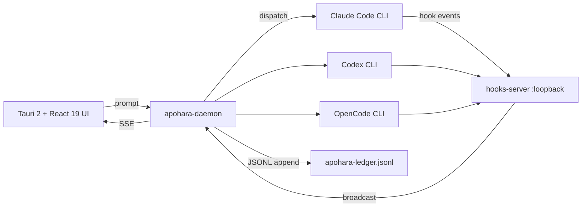

# Apohara Architecture

> Local-first multi-AI orchestrator. Three CLI subscriptions, one kanban.

This document is a high-altitude tour of the runtime. For load-bearing
specifics, follow the links into `docs/superpowers/specs/` and the per-crate
`AGENTS.md` files. The system-level rationale ("why" rather than "what") lives
in [`PRINCIPLES.md`](../PRINCIPLES.md) and [`ARCHITECTURE.md`](../ARCHITECTURE.md).

## High-level flow



The UI never talks to a provider CLI directly. Every dispatch flows through
`apohara-daemon`, which serialises per-binary calls (FIFO queue) to avoid the
`~/.claude/` lock contention bug documented in `CLAUDE.md`. Hook events from
the CLIs land on `apohara-hooks-server` (axum sidecar bound to loopback), get
deduplicated by stampede control, and are pushed back to the daemon for ledger
append + SSE fan-out.

## Components

### Rust workspace (`crates/`, 24+ crates)

| Crate | Responsibility |
|---|---|
| `apohara-daemon` | Background process — orchestration brain (Sprint 6 G6.A). |
| `apohara-client` | UI process side — connects via local socket (G6.A). |
| `apohara-ws-hub` | Pub/sub with dedupe + stampede control (G6.A). |
| `apohara-transport` | Local socket + HTTP poll fallback (G6.A). |
| `apohara-ssh-server` | SSH listener for distributed compute (G6.C). |
| `apohara-remote-worker` | Worker side of the SSH compute pool (G6.C). |
| `apohara-reaction-engine` | 13-state lifecycle for smart automation (G6.D). |
| `apohara-coordinator` | Coordinator class with tick loop (T4.6). |
| `apohara-hooks-server` | Axum sidecar for hook event ingestion (T4.5). |
| `apohara-token-accounting` | Per-thread absolute counter — no deltas (T4.1, §0.14). |
| `apohara-mcp-bridge` | JSONC + canonical config adapter (T4.8a). |
| `apohara-types` | Shared types Rust↔TS (ts-rs SSoT, §0.7). |
| `apohara-secrets` | OS-native credential store (keyring-rs). |
| `apohara-pathsafety` | Symlink-escape detection. |
| `apohara-audit` | JSONL audit sink + rotation + `fchmod 0600`. |
| `apohara-notifications` | Cross-platform push notifications. |
| `apohara-persistence` | Cross-platform service installer. |
| `apohara-worktree` | Git worktree lifecycle (3-tier GC, G6.B). |
| `apohara-attention` | Attention bands state machine (HOT/WARM/COOL/IDLE). |
| `apohara-event-humanizer` | Provider events → human-readable labels. |
| `apohara-anti-thrash` | Strategy rotation tracker (anti-loop). |
| `apohara-indexer` | tree-sitter + redb + Nomic BERT (OOM hazard, see below). |
| `apohara-sandbox` | seccomp-bpf + namespaces sandbox. |

### TypeScript domains (`src/core/`)

| Path | Responsibility |
|---|---|
| `providers/` | `BaseAgentProvider` + 3 Protocol implementations (T4.7). |
| `orchestration/` | `DispatchTask`, `PoisonedSession`, `DuplicateGuard`, `AvailableActions`, `/yolo` (T4.4, G5.D, G6.E). |
| `safety/` | `RunnerPolicy`, `DurablePromptStore`, `PermissionGrid` (T4.2, T4.3, G5.D). |
| `verification/` | Dual-status AC, critic prompts, hallucination flag (G5.D). |
| `filter-dsl/` | Safe predicate parser + applier (G5.E). |
| `whisper/` | Stderr structured protocol (G5.E). |
| `config/` | Versioned schema + decentralized discovery (T4.8b, G5.E). |
| `worktree/gc-tiered/` | 3-tier storage with auto-downgrade (G6.B). |
| `hooks/` | Agent-hooks installer + events bridge. |
| `decomposer/` | SPEC → tasks manifest decomposer. |
| `mcp/` | Internal MCP servers (bootstrap, canonical schema, injection). |
| `cli/` | Shared CLI errors + output helpers (`apohara doctor`, `verify-setup`, etc.). |

### Packages (`packages/`)

| Package | Responsibility |
|---|---|
| `desktop/` | Tauri 2 + React 19 UI (TaskBoard, Plans, Permissions, VerificationTimeline). |
| `apohara-shared/` | ts-rs SSoT types — **never edit by hand** (§0.7). |
| `github-bridge/` | Issue → reaction trigger; poll-only in v1.0 (webhook returns 501). |
| `tui/` | Ink-based terminal UI (Dashboard, AgentList, CostTable, config wizard). |

## Identity rules (NON-negotiable)

- **Tauri 2**, NO Electron.
- **bun:sqlite + Rust SQLx**, NO PostgreSQL.
- **Single-user-per-machine**, NO multi-tenant.
- **CLI wrappers ONLY**, NO OAuth flows.
- **Local-first**, NO cloud sync.
- No PostHog telemetry (anonymous install-id + denylist OK per §0.33).

## Cross-cutting disciplines (spec §0)

The 33 disciplines in `docs/superpowers/specs/2026-05-21-apohara-v1-design.md#0-disciplinas-transversales`
are guardrails, not suggestions. The ones that bite hardest in practice:

- **§0.1** centralised IPC listeners — never per-component subscribers.
- **§0.4** env sanitisation on every spawn — no API keys reach a subprocess.
- **§0.7** ts-rs SSoT — `packages/apohara-shared/types.ts` is generated.
- **§0.8** atomic file writes — `mkstemp` + `rename`, never partial writes.
- **§0.14** token accounting — absolutes win, deltas drift.
- **§0.16** `enum_dispatch` for providers — no `Box<dyn>` in hot paths.

See the "Past incidents" section of `CLAUDE.md` for the bugs that taught us
each rule. Breaking one regresses Apohara measurably; the audit history
preserves the *why* so future engineers don't relitigate.

## OOM hazard with `cargo test`

**NEVER** run bare `cargo test` or `cargo test -p apohara-indexer`. The Nomic
BERT model is ~400 MB and `cargo test` spawns lib + integration binaries
concurrently, OOM-ing a 16 GB host. See spec §10 R1.

Always run one test binary at a time:

```bash
cargo test -p apohara-indexer --lib
cargo test -p apohara-indexer --test memory_integration
cargo test -p apohara-indexer --test indexer_persistence
```

CI uses `APOHARA_MOCK_EMBEDDINGS=1` to skip the model load entirely.

## Further reading

- [`PRINCIPLES.md`](../PRINCIPLES.md) — the six commitments behind every "no" in v1.0.
- [`ARCHITECTURE.md`](../ARCHITECTURE.md) — system diagram + crate map (longer form).
- [`docs/superpowers/specs/2026-05-21-apohara-v1-design.md`](superpowers/specs/2026-05-21-apohara-v1-design.md) — full v1.0 spec.
- [`docs/superpowers/plans/2026-05-22-apohara-v1.md`](superpowers/plans/2026-05-22-apohara-v1.md) — task-by-task plan.
- [`docs/superpowers/plans/2026-05-22-apohara-ultimate-sprint-7.md`](superpowers/plans/2026-05-22-apohara-ultimate-sprint-7.md) — release sprint plan.
