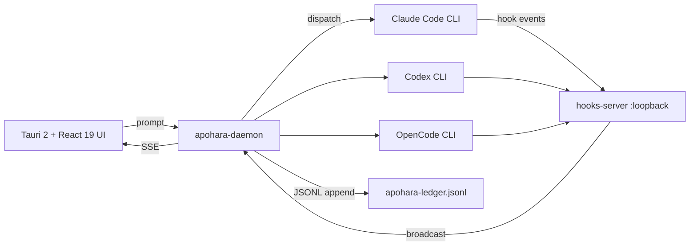

# Apohara Ultimate Sprint 7 — Ship + Polish Implementation Plan

> **For agentic workers:** REQUIRED SUB-SKILL: Use superpowers:subagent-driven-development (recommended) or superpowers:executing-plans to implement this plan task-by-task. Steps use checkbox (`- [ ]`) syntax for tracking.

**Goal:** Shippear `v1.0.0` tagged en GitHub con binaries reales attacheados por platform slug, `apohara` publicado a npm public registry, README en estado "repo-of-the-day", demo end-to-end verificado cross-platform.

**Architecture:** 6 grupos operacionales en 3 waves. Mucho del trabajo es CI workflow + copy editorial — no TDD code-heavy. Foco: verificación end-to-end + release artifacts. Branch destino: `feat/apohara-ultimate-sprint-7` (deriva de `feat/apohara-ultimate` post-Sprint-6).

**Tech Stack:** GitHub Actions (workflows: `desktop-release.yml`, `npm-publish.yml`, `ci.yml`) + npm + Cargo + Tauri 2 build + cross compile. Sin código nuevo de aplicación — solo wiring de release.

---

## Estructura del Sprint 7

### 6 grupos operacionales

| Grupo | Tema | # tareas | Esfuerzo | Wave |
|---|---|---:|---:|---|
| **G7.A** | Release pipeline real | 8 | 2-3 días | 1 (detallado) |
| **G7.B** | Documentation + landing copy | 10 | 2-3 días | 1 (parcial detallado) |
| **G7.C** | Polish UI/UX restantes | 9 | 3-4 días | 1 (parcial detallado) |
| **G7.D** | CI/CD hardening | 6 | 2 días | 1 (detallado) |
| **G7.E** | Final integration smoke | 6 | 2-3 días | 2 |
| **G7.F** | Release & tag | 5 | 1 día | 2 (depende Wave 1 + G7.E) |

### Estrategia de detalle

- **Wave 1 (G7.A + G7.B + G7.C + G7.D)**: paralelizables, archivos disjuntos. G7.A + G7.D tienen TDD-style verification (workflow YAML + CI matrix). G7.B + G7.C son copy/UX work — el implementer aplica juicio editorial.
- **Wave 2 (G7.E + G7.F)**: secuencial post-Wave 1. G7.E corre integration smoke; G7.F es release final con tag + publish.

---

## Setup pre-Wave

- [ ] **Setup 1: Crear branch**

```bash
git checkout feat/apohara-ultimate
git checkout -b feat/apohara-ultimate-sprint-7
```

- [ ] **Setup 2: Verificar base verde**

Run: `bun test tests/integration/ tests/unit/ tests/core/ tests/opencode-ndjson.test.ts tests/npx-cli/`
Expected: ~1100-1200 pass / 0 fail (Sprint 6 close baseline)

---

## Wave 1 — Días 1-4 (4 paralelos)

### G7.A — Release pipeline real (8 tareas)

**Outcome esperado:** GitHub Release tag-triggered pipeline produce 6 binarios (linux-x64/arm64, darwin-x64/arm64, win32-x64/arm64) + 6 sha256 sidecars + Tauri bundles (.deb/.AppImage/.dmg/.msi/.app). npx-cli publica a npm en mismo tag push.

#### Task G7.A.1: Add linux-arm64 + win32-arm64 to desktop-release matrix

**Files:**
- Modify: `.github/workflows/desktop-release.yml` (existing — agregar 2 matrix entries)

- [ ] **Step 1: Inspeccionar matrix actual**

Run: `cat .github/workflows/desktop-release.yml | grep -A 60 'matrix:'`
Anotar las 4 entries actuales (darwin-x64, darwin-arm64, linux-x64, win-x64).

- [ ] **Step 2: Agregar entries linux-arm64 + win32-arm64**

```yaml
          - runner: ubuntu-22.04
            os-name: linux-arm64
            artifact-glob: |
              target/release/apohara-desktop
              target/release/bundle/deb/*.deb
              target/release/bundle/appimage/*.AppImage
            system-deps: |
              sudo apt-get update
              sudo apt-get install -y \
                libwebkit2gtk-4.1-dev \
                libsoup-3.0-dev \
                librsvg2-dev \
                libgtk-3-dev \
                libayatana-appindicator3-dev \
                gcc-aarch64-linux-gnu
              rustup target add aarch64-unknown-linux-gnu
            cargo-target: aarch64-unknown-linux-gnu
          - runner: windows-2022
            os-name: win32-arm64
            artifact-glob: |
              target/release/apohara-desktop.exe
              target/release/bundle/msi/*.msi
              target/release/bundle/nsis/*.exe
            system-deps: |
              rustup target add aarch64-pc-windows-msvc
            cargo-target: aarch64-pc-windows-msvc
```

Modificar también el build step para pasar `--target ${{ matrix.cargo-target }}` cuando esté seteado.

- [ ] **Step 3: Commit**

```bash
git commit -m "$(cat <<'EOF'
feat(ci): add linux-arm64 + win32-arm64 to desktop-release matrix (G7.A.1)

npx-cli espera 6 platform slugs (linux-x64/arm64, darwin-x64/arm64,
win32-x64/arm64). Pre-G7.A.1 el matrix solo cubría 4 (faltaban los
arm64 de Linux y Windows). Cross-compile vía rustup target add +
gcc-aarch64-linux-gnu para Linux ARM.

Co-Authored-By: Claude Opus 4.7 <noreply@anthropic.com>
EOF
)" .github/workflows/desktop-release.yml
```

#### Task G7.A.2: Rename artifacts to `apohara-desktop-<slug>` schema

**Files:**
- Modify: `.github/workflows/desktop-release.yml` (post-build step)

- [ ] **Step 1: Agregar rename step pre-upload**

```yaml
      - name: Rename binary to platform-slugged name
        if: runner.os != 'Windows'
        run: |
          mkdir -p target/release-renamed
          cp target/release/apohara-desktop "target/release-renamed/apohara-desktop-${{ matrix.os-name }}"
      - name: Rename binary (Windows)
        if: runner.os == 'Windows'
        shell: pwsh
        run: |
          New-Item -ItemType Directory -Force -Path target/release-renamed
          Copy-Item "target/release/apohara-desktop.exe" "target/release-renamed/apohara-desktop-${{ matrix.os-name }}.exe"
```

Actualizar `artifact-glob` para incluir `target/release-renamed/*`.

- [ ] **Step 2: Commit**

```bash
git commit -m "$(cat <<'EOF'
feat(ci): rename binaries to apohara-desktop-<slug> schema (G7.A.2)

npx-cli/src/download.ts espera el binary con sufijo de platform slug.
Pre-G7.A.2 el binary se subía como `apohara-desktop` genérico —
download fallaba 404. Rename step duplica el binary con nombre
correcto antes del upload.

Co-Authored-By: Claude Opus 4.7 <noreply@anthropic.com>
EOF
)" .github/workflows/desktop-release.yml
```

#### Task G7.A.3: Generate sha256 sidecars per artifact

**Files:**
- Modify: `.github/workflows/desktop-release.yml` (post-rename step)

- [ ] **Step 1: Agregar sha256 generation**

```yaml
      - name: Generate sha256 sidecar
        if: runner.os != 'Windows'
        run: |
          cd target/release-renamed
          for f in apohara-desktop-*; do
            if [ -f "$f" ] && [ "${f##*.}" != "sha256" ]; then
              sha256sum "$f" | awk '{print $1}' > "$f.sha256"
            fi
          done
      - name: Generate sha256 sidecar (Windows)
        if: runner.os == 'Windows'
        shell: pwsh
        run: |
          Get-ChildItem "target/release-renamed/apohara-desktop-*" -Exclude *.sha256 | ForEach-Object {
            $hash = Get-FileHash -Algorithm SHA256 $_.FullName
            $hash.Hash.ToLower() | Out-File -NoNewline -Encoding ASCII "$($_.FullName).sha256"
          }
```

- [ ] **Step 2: Commit**

```bash
git commit -m "$(cat <<'EOF'
feat(ci): generate sha256 sidecars per platform binary (G7.A.3)

npx-cli/src/download.ts verifica sha256 con `<binary>.sha256` sidecar
descargado en paralelo (vibe-kanban atomic upgrade pattern). Sin
sidecar, npx-cli reject el binary con error claro. Generated post-
rename, pre-upload.

Co-Authored-By: Claude Opus 4.7 <noreply@anthropic.com>
EOF
)" .github/workflows/desktop-release.yml
```

#### Task G7.A.4: Cleanup legacy release.yml workflow

**Files:**
- Delete: `.github/workflows/release.yml` (apuntaba a `isolation-engine/` que ya no existe)

- [ ] **Step 1: Verify legacy state**

Run: `cat .github/workflows/release.yml | head -20`
Confirmar referencia a `isolation-engine` directory.

- [ ] **Step 2: Delete + commit**

```bash
git rm .github/workflows/release.yml
git commit -m "$(cat <<'EOF'
chore(ci): remove legacy release.yml (G7.A.4)

Apuntaba a isolation-engine/ que ya no existe (renombrado a
apohara-worktree crate hace meses). desktop-release.yml + el nuevo
npm-publish.yml (G7.A.5) cubren el flujo real ahora.

Co-Authored-By: Claude Opus 4.7 <noreply@anthropic.com>
EOF
)"
```

#### Task G7.A.5: Create npm-publish.yml workflow

**Files:**
- Create: `.github/workflows/npm-publish.yml`

- [ ] **Step 1: Implementar**

```yaml
name: Publish npm

on:
  push:
    tags:
      - 'v*'
  workflow_dispatch:

jobs:
  publish:
    name: Publish apohara to npm
    runs-on: ubuntu-latest
    permissions:
      contents: read
      id-token: write
    steps:
      - uses: actions/checkout@v4
      - uses: actions/setup-node@v4
        with:
          node-version: '20'
          registry-url: 'https://registry.npmjs.org'
      - name: Install dependencies
        working-directory: npx-cli
        run: npm ci
      - name: Build CLI bundle
        working-directory: npx-cli
        run: npm run build
      - name: Publish to npm (public)
        working-directory: npx-cli
        run: npm publish --access public --provenance
        env:
          NODE_AUTH_TOKEN: ${{ secrets.NPM_TOKEN }}
```

- [ ] **Step 2: Commit**

```bash
git add .github/workflows/npm-publish.yml
git commit -m "$(cat <<'EOF'
feat(ci): npm-publish.yml workflow (G7.A.5)

Tag-push triggered. Setup Node 20, install + build npx-cli, publish
to npm public registry con --provenance attestation. Requires
NPM_TOKEN secret en repo settings.

Co-Authored-By: Claude Opus 4.7 <noreply@anthropic.com>
EOF
)" .github/workflows/npm-publish.yml
```

#### Task G7.A.6: Bump Cargo.toml workspace version 1.0.0-dev → 1.0.0

**Files:**
- Modify: `Cargo.toml` (root, workspace.package.version)

- [ ] **Step 1: Inspeccionar version actual**

Run: `grep -A 5 'workspace.package' Cargo.toml`

- [ ] **Step 2: Bump**

Cambiar `version = "1.0.0-dev"` → `version = "1.0.0"`.

- [ ] **Step 3: Commit**

```bash
git commit -m "$(cat <<'EOF'
chore: bump Cargo workspace version 1.0.0-dev → 1.0.0 (G7.A.6)

Sprint 7 cierre prep — strip pre-release suffix.

Co-Authored-By: Claude Opus 4.7 <noreply@anthropic.com>
EOF
)" Cargo.toml
```

#### Task G7.A.7: Bump npx-cli/package.json version 0.1.0 → 1.0.0

**Files:**
- Modify: `npx-cli/package.json`

- [ ] **Step 1: Bump version field**

- [ ] **Step 2: Commit**

```bash
git commit -m "$(cat <<'EOF'
chore: bump npx-cli version 0.1.0 → 1.0.0 (G7.A.7)

Aligns with Cargo workspace 1.0.0 + GitHub Release tag v1.0.0.

Co-Authored-By: Claude Opus 4.7 <noreply@anthropic.com>
EOF
)" npx-cli/package.json
```

#### Task G7.A.8: E2E smoke test for `npx apohara@<version>` from clean directory

**Files:**
- Create: `tests/integration/npx-install-smoke.test.ts`

- [ ] **Step 1: Failing test**

```typescript
import { expect, test } from "bun:test";
import { spawn } from "node:child_process";
import { mkdtemp, rm } from "node:fs/promises";
import { tmpdir } from "node:os";
import { join } from "node:path";

test("npx apohara --version returns version string", async () => {
  // Skip if not in CI release context — local dev doesn't have published
  // package yet. CI sets APOHARA_TEST_PUBLISHED_VERSION when ready.
  const ver = process.env.APOHARA_TEST_PUBLISHED_VERSION;
  if (!ver) {
    console.warn("APOHARA_TEST_PUBLISHED_VERSION not set, skipping npx smoke");
    return;
  }
  const dir = await mkdtemp(join(tmpdir(), "apohara-npx-smoke-"));
  try {
    const result = await new Promise<{ code: number; stdout: string }>((resolve) => {
      const child = spawn("npx", [`apohara@${ver}`, "--version"], {
        cwd: dir,
        env: { ...process.env, PATH: process.env.PATH },
      });
      let stdout = "";
      child.stdout?.on("data", (c) => { stdout += c.toString(); });
      child.on("exit", (code) => resolve({ code: code ?? 1, stdout }));
    });
    expect(result.code).toBe(0);
    expect(result.stdout).toContain(ver);
  } finally {
    await rm(dir, { recursive: true, force: true });
  }
});
```

- [ ] **Step 2: Commit**

```bash
git add tests/integration/npx-install-smoke.test.ts
git commit -m "$(cat <<'EOF'
test(integration): npx install smoke for published version (G7.A.8)

Gateado por APOHARA_TEST_PUBLISHED_VERSION env var — solo corre en
CI release context. Verifica que `npx apohara@<ver> --version`
descarga, verifica sha256, ejecuta el binario, y devuelve la versión.

Co-Authored-By: Claude Opus 4.7 <noreply@anthropic.com>
EOF
)" tests/integration/npx-install-smoke.test.ts
```

---

### G7.B — Documentation + landing copy (10 tareas, parcial detallado)

**Outcome esperado:** README en estado "repo-of-the-day", trust badges, hero screenshot, CHANGELOG, docs/{architecture,getting-started,troubleshooting}.

#### Task G7.B.1: README — pain→relief grid + tagline (de plan §11.6)

**Files:**
- Modify: `README.md` (existing)

- [ ] **Step 1: Inspeccionar plan §11.6**

Run: `grep -A 30 'pain.*relief\|For builders who ship' docs/superpowers/plans/2026-05-22-reference-mining-sprints.md`

Anotar copy pre-escrito (5 items de pain→relief grid + tagline).

- [ ] **Step 2: Reemplazar header del README**

Estructura target:

```markdown
# Apohara

> **For builders who ship.** Multi-AI orchestrator that wraps your CLI subscriptions
> (Claude Code, Codex, OpenCode) into a single local-first kanban dispatcher.
> No OAuth. No cloud sync. No per-token pricing. Your subscriptions, your machine,
> your control.

## Pain → Relief

| Pain (today) | Apohara (relief) |
|---|---|
| Each CLI agent runs in isolation; you copy-paste between them | One kanban; agents dispatched via your existing subscriptions |
| OAuth flows leak your subscription tier across vendors | Apohara wraps the CLIs — your auth stays where it always was |
| Run "claude code" and pray you didn't miss the right output | Hook events stream live to the UI; verification timeline shows what passed |
| Three providers, three CLIs, three terminal windows | Three providers, one Apohara, one git history |
| Lose track of which task ran which prompt | Every dispatch persisted in JSONL ledger; replay any session |
```

(El implementer adapta exactamente el copy del plan §11.6 si difiere)

- [ ] **Step 3: Commit**

```bash
git commit -m "$(cat <<'EOF'
docs(readme): pain→relief grid + tagline (G7.B.1)

Aplica el copy pre-escrito en plan §11.6 (nimbalyst-landing finding
F1 + F8 audit identificó como cheap-win unshippeado). README ahora
abre con value proposition concreta vs. competencia.

Co-Authored-By: Claude Opus 4.7 <noreply@anthropic.com>
EOF
)" README.md
```

#### Task G7.B.2: Trust badges + DOI link al paper INV-15

**Files:**
- Modify: `README.md`

- [ ] **Step 1: Agregar badges en top del README**

```markdown
[](https://github.com/SuarezPM/apohara/actions/workflows/ci.yml)
[](https://github.com/SuarezPM/apohara/actions)
[](LICENSE)
[](https://doi.org/10.5281/zenodo.20114594)
[](https://www.npmjs.com/package/apohara)
```

(Ajustar org name si difiere de SuarezPM)

- [ ] **Step 2: Commit**

```bash
git commit -m "$(cat <<'EOF'
docs(readme): trust badges + DOI link (G7.B.2)

Build / tests / license / DOI / npm version. nimbalyst-landing F6.
DOI vincula al paper INV-15 (Z3-verified verification mesh) que
solo vivía en ROADMAP.md:35.

Co-Authored-By: Claude Opus 4.7 <noreply@anthropic.com>
EOF
)" README.md
```

#### Task G7.B.3: Hero screenshot capture

**Files:**
- Create: `docs/img/hero.png` (binary asset)
- Modify: `README.md` (reference)

- [ ] **Step 1: Start dev server + seed demo + capture**

```bash
cd packages/desktop && APOHARA_DESKTOP_PORT=7331 bun --hot src/server.ts &
sleep 3
# Manual capture via Playwright MCP or curl-based screenshot
# Save to docs/img/hero.png
```

Alternativa: usar Playwright MCP browser tools si están disponibles:

```bash
# (mcp) browser_navigate http://localhost:7331
# (mcp) browser_click "+Seed demo tasks"
# (mcp) browser_take_screenshot --output docs/img/hero.png
```

- [ ] **Step 2: Reference en README**

```markdown

```

- [ ] **Step 3: Commit (binary asset + README ref)**

```bash
git add docs/img/hero.png README.md
git commit -m "$(cat <<'EOF'
docs(readme): hero screenshot from seed-demo dashboard (G7.B.3)

nimbalyst-landing F11 — UI es demo-eable con `+Seed demo tasks`
button (App.tsx:309) pero ninguna imagen vivía en docs/img/. Capture
del kanban con 5 tasks + VerificationTimeline footer.

Co-Authored-By: Claude Opus 4.7 <noreply@anthropic.com>
EOF
)"
```

#### Task G7.B.4: CHANGELOG.md curated para v1.0.0

**Files:**
- Create or Modify: `CHANGELOG.md`

- [ ] **Step 1: Generar entry de v1.0.0**

```markdown
# Changelog

## [1.0.0] — 2026-05-23

### Added — Sprint 4 (Foundation/Bug-barrels)
- Token accounting per-thread absolute (T4.1) — closes spec §0.14
- DurablePromptStore JSONL-backed (T4.2)
- Runner policy wired to spawn path (T4.3) — closes agentrail #8
- Poisoned session detection + quarantine (T4.4a) — closes multica #7
- Duplicate prevention guard (T4.4b) — closes multica #13
- Settings versioning chain (T4.4c) — closes multica #17
- Hooks server broadcast channel (T4.5) — closes orca #1
- Coordinator class with tick loop (T4.6) — closes orca #9
- Real spawn in ClaudeCodeProtocol / CodexProtocol / OpenCodeProtocol (T4.7) — closes nimbalyst #1.2
- JSONC CST with comment preservation (T4.8a) — closes spec §0.27
- Versioned Config Schema + migration chain (T4.8b) — closes vibe-kanban #10

### Added — Sprint 5 (Mid-stack features)
- availableActions[] contract (G5.D.1) + critic prompts (G5.D.4) + dual-status AC (G5.D.3) + hallucination flag (G5.D.5) + permission grid (G5.D.6) + registerPermissionedTool (G5.D.2)
- Filter DSL parser+applier (G5.E.1) + Whisper stderr protocol (G5.E.2) + universal verbs (G5.E.3) + passthrough CLI (G5.E.4) + decentralized config (G5.E.5) + TaggedEventBus (G5.E.6) + skills install (G5.E.7)
- Multica mid-stack: secret redactor, atomic JSONL, UUID validate, empty-claim cache, lifecycle hooks, per-thread keying
- Backlog Tier 3: WSL handling, learn cmd, parseWithFallback, OSC 998, git cherry status, named locks, prompt cache

### Added — Sprint 6 (v1.1+ Promovidos)
- Workspace GC 3-tier (G6.B) — closes multica #8 promoted
- /yolo full-auto pipeline with TRIPLE-OFF defense (G6.E) — closes Chorus /yolo promoted
- Multi-process foundation: daemon + client + WS hub + transport + profiles (G6.A) — closes multica cliente-daemon split promoted
- Distributed compute: SSH server + worker + handshake + recovery (G6.C) — closes vibe-kanban embedded SSH + symphony SSH worker promoted
- Smart automation: Intent classifier + Reaction Engine state machine (G6.D) — closes claude-octopus #12 + #13 promoted

### Changed
- Workspace version 1.0.0-dev → 1.0.0 (G7.A.6)
- npx-cli version 0.1.0 → 1.0.0 (G7.A.7)

### Fixed
- See `feat(ultimate)` squash commits for the full list — over 80 follow-ups + code-review fixes applied during waves.

### Deprecated
- Legacy `.github/workflows/release.yml` (removed in G7.A.4 — pointed to isolation-engine/ directory that no longer exists).

### Security
- All spawns route through `sanitizeEnv()` (§0.4) — no API keys leak to subprocesses.
- /yolo mode requires TRIPLE OFF gates (env + UI + per-workspace allowlist file with non-empty content).
- SSH server bind 127.0.0.1 only + key-based auth obligatorio (no password).

### Identity (preserved)
- Tauri 2 (no Electron), bun:sqlite + Rust SQLx (no PostgreSQL), single-user-per-machine (no multi-tenant), CLI wrappers only (no OAuth), local-first (no cloud sync).
```

- [ ] **Step 2: Commit**

```bash
git add CHANGELOG.md
git commit -m "$(cat <<'EOF'
docs: CHANGELOG.md curated para v1.0.0 (G7.B.4)

Resumen de Sprints 4 + 5 + 6 features. Atribución por task ID
(T4.x, G5.x, G6.x) para trazabilidad inversa al plan / audit.
Identity section preserva las 11 decisiones "NO robamos".

Co-Authored-By: Claude Opus 4.7 <noreply@anthropic.com>
EOF
)"
```

#### Task G7.B.5: docs/architecture.md (overview + diagram Mermaid)

**Files:**
- Create: `docs/architecture.md`

- [ ] **Step 1: Implementar overview con diagram**

```markdown
# Apohara Architecture

> Local-first multi-AI orchestrator. Three CLI subscriptions, one kanban.

## High-level flow



## Components

### crates/ (Rust workspace, 24+ crates)
- `apohara-daemon` — background process (Sprint 6 G6.A)
- `apohara-client` — UI process connects via local socket (G6.A)
- `apohara-ws-hub` — pub/sub with dedupe + stampede control (G6.A)
- `apohara-transport` — local socket + HTTP poll fallback (G6.A)
- `apohara-ssh-server` + `apohara-remote-worker` — distributed compute (G6.C)
- `apohara-reaction-engine` — 13-state lifecycle (G6.D)
- `apohara-coordinator` — Coordinator class with tick loop (T4.6)
- `apohara-hooks-server` — axum sidecar for hook event ingestion (T4.5)
- `apohara-token-accounting` — per-thread absolute counter (T4.1)
- `apohara-mcp-bridge` — JSONC + canonical config adapter (T4.8a)
- ... 14 more crates (see Cargo.toml)

### src/core/ (TypeScript domains)
- `providers/` — BaseAgentProvider + 3 Protocol implementations (T4.7)
- `orchestration/` — DispatchTask, PoisonedSession, DuplicateGuard, AvailableActions, Yolo (T4.4, G5.D, G6.E)
- `safety/` — RunnerPolicy, DurablePromptStore, PermissionGrid (T4.2, T4.3, G5.D)
- `verification/` — DualStatusAC, critic prompts, hallucination flag (G5.D)
- `filter-dsl/` — safe predicate parser + applier (G5.E)
- `whisper/` — stderr structured protocol (G5.E)
- `config/` — Versioned schema + decentralized discovery (T4.8b, G5.E)
- `worktree/gc-tiered/` — 3-tier storage with auto-downgrade (G6.B)

### packages/
- `desktop/` — Tauri 2 + React 19 UI
- `apohara-shared/` — ts-rs SSoT types (NEVER edit by hand, §0.7)
- `github-bridge/` — Issue → reaction trigger (G6.D)
- `tui/` — Ink-based terminal UI

## Identity rules (NON-negotiable)

- **Tauri 2**, NO Electron
- **bun:sqlite + Rust SQLx**, NO PostgreSQL
- **Single-user-per-machine**, NO multi-tenant
- **CLI wrappers ONLY**, NO OAuth flows
- **Local-first**, NO cloud sync
- Sin PostHog telemetry (install-id anónimo + denylist OK per §0.33)
```

- [ ] **Step 2: Commit**

```bash
git add docs/architecture.md
git commit -m "$(cat <<'EOF'
docs(architecture): high-level overview + Mermaid diagram (G7.B.5)

Componentes Rust (crates/) + TS (src/core/) + paquetes (packages/).
Identity rules preservadas. Trazabilidad por task ID a Sprint 4/5/6.

Co-Authored-By: Claude Opus 4.7 <noreply@anthropic.com>
EOF
)"
```

#### Tasks G7.B.6 — G7.B.10 (abreviados — copywork repetitivo)

- **G7.B.6**: `docs/getting-started.md` (5-min quickstart: install via npx, run UI, seed demo, click Run, observe kanban)
- **G7.B.7**: `docs/troubleshooting.md` (common errors: claude binary not in PATH, daemon not starting, hooks 401, etc.)
- **G7.B.8**: `apohara doctor` output polish (banners + actionable hints — modify `src/cli/doctor.ts`)
- **G7.B.9**: Logo wall placeholder (F4 — table row "_logo wall coming post-launch_" in README)
- **G7.B.10**: Testimonials slot (F5 — placeholder div in README "_testimonials at v1.1_")

Cada uno: 0.3-0.5 día. Implementer ejecuta secuencialmente con commits granulares.

---

### G7.C — Polish UI/UX restantes (9 tareas, abreviadas)

Las 9 tareas son UI/UX gaps marcados ❌ o 🟡 en los audits que no fueron core para Sprint 5. Cada una ~0.3-0.5 día.

| ID | Tarea | Files clave |
|---|---|---|
| G7.C.1 | Permission grid UI (chorus H10 resolved en G5.D.6 — wire al UI) | `packages/desktop/src/components/PermissionGridPanel.tsx` |
| G7.C.2 | Notifier multi-subscribe (chorus H19) | `src/core/notifier.ts` (modify) |
| G7.C.3 | EventSource onReconnect backfill (chorus H18) | `src/core/sse-client.ts` (modify) |
| G7.C.4 | Last-Event-ID en SSE para resume (agentrail #12) | `src/core/sse-server.ts` (modify) |
| G7.C.5 | Sound files para notifications (vibe-kanban #17) | `packages/desktop/src/assets/sounds/` + `notifier.ts` integration |
| G7.C.6 | Statusline bridge (claude-octopus #3) — wire al UI footer | `packages/desktop/src/components/Statusline.tsx` |
| G7.C.7 | F11 hero screenshot en UI banner (no solo README) | `packages/desktop/src/components/HeroBanner.tsx` (only-on-empty-state) |
| G7.C.8 | F13 footer copy + F7 download CTA en README | `README.md` (extend) |
| G7.C.9 | OSC 998 command-state rendering (T3.17 logic ya existe G5.I.5 — wire al PTY view) | `packages/desktop/src/components/TerminalPane.tsx` (modify) |

---

### G7.D — CI/CD hardening (6 tareas)

**Outcome esperado:** CI matrix expandido, cargo audit + license scan gates, bundle size guards, perf regression baselines.

#### Task G7.D.1: Expand CI matrix (Node 20 + 22 × Linux + macOS + Windows)

**Files:**
- Modify: `.github/workflows/ci.yml`

- [ ] **Step 1: Update matrix**

```yaml
    strategy:
      fail-fast: false
      matrix:
        os: [ubuntu-22.04, ubuntu-24.04, macos-13, macos-14, windows-2022]
        node: [20, 22]
```

- [ ] **Step 2: Commit**

```bash
git commit -m "$(cat <<'EOF'
feat(ci): expand matrix to 5 OS × 2 Node versions (G7.D.1)

Pre-G7.D.1: 3 OS × 1 Node. Post: 10 jobs total (Ubuntu 22/24, macOS 13/14
M-series + Intel, Windows 2022) × Node 20/22. fail-fast off para ver
TODAS las que rompen.

Co-Authored-By: Claude Opus 4.7 <noreply@anthropic.com>
EOF
)" .github/workflows/ci.yml
```

#### Task G7.D.2: Cargo audit gate en cada PR

**Files:**
- Modify: `.github/workflows/ci.yml`

- [ ] **Step 1: Agregar audit job**

```yaml
  cargo-audit:
    name: Cargo audit
    runs-on: ubuntu-latest
    steps:
      - uses: actions/checkout@v4
      - uses: dtolnay/rust-toolchain@stable
      - run: cargo install cargo-audit
      - run: cargo audit --deny warnings
```

- [ ] **Step 2: Commit**

```bash
git commit -m "$(cat <<'EOF'
feat(ci): cargo audit gate (G7.D.2)

Falla CI si dependency tree contiene vulnerabilidad RUSTSEC-* con
severity warnings+. Earlier-warning system pre-release.

Co-Authored-By: Claude Opus 4.7 <noreply@anthropic.com>
EOF
)" .github/workflows/ci.yml
```

#### Task G7.D.3: License scan (cargo-deny + license-checker)

**Files:**
- Create: `deny.toml` (cargo-deny config)
- Modify: `.github/workflows/ci.yml`

- [ ] **Step 1: deny.toml**

```toml
[licenses]
allow = ["MIT", "Apache-2.0", "Apache-2.0 WITH LLVM-exception", "BSD-3-Clause", "BSD-2-Clause", "ISC", "Unicode-DFS-2016"]
confidence-threshold = 0.93
```

- [ ] **Step 2: Workflow job**

```yaml
  license-scan:
    runs-on: ubuntu-latest
    steps:
      - uses: actions/checkout@v4
      - uses: EmbarkStudios/cargo-deny-action@v2
        with: { command: check }
      - uses: actions/setup-node@v4
        with: { node-version: '20' }
      - run: npx license-checker --production --onlyAllow "MIT;Apache-2.0;BSD-3-Clause;BSD-2-Clause;ISC"
```

- [ ] **Step 3: Commit**

```bash
git commit -m "$(cat <<'EOF'
feat(ci): license scan via cargo-deny + license-checker (G7.D.3)

Hardcoded allowlist: MIT, Apache-2.0, BSD-{2,3}, ISC, Unicode-DFS.
Falla CI si una transitive dep introduce GPL/AGPL/CC-BY-NC/etc.
Pre-release defense contra license bombs.

Co-Authored-By: Claude Opus 4.7 <noreply@anthropic.com>
EOF
)" deny.toml .github/workflows/ci.yml
```

#### Task G7.D.4: Bundle size guard regression test

**Files:**
- Create: `scripts/check-bundle-size.sh`
- Modify: `.github/workflows/ci.yml`

- [ ] **Step 1: Script**

```bash
#!/usr/bin/env bash
set -euo pipefail
BUDGET_DESKTOP=$((200 * 1024 * 1024))  # 200MB
BUDGET_NPX=$((500 * 1024))             # 500KB
size_desktop=$(stat -c%s target/release/apohara-desktop 2>/dev/null || stat -f%z target/release/apohara-desktop)
size_npx=$(stat -c%s npx-cli/dist/cli.js 2>/dev/null || stat -f%z npx-cli/dist/cli.js)
[ "$size_desktop" -le "$BUDGET_DESKTOP" ] || { echo "FAIL: desktop binary $size_desktop > $BUDGET_DESKTOP"; exit 1; }
[ "$size_npx" -le "$BUDGET_NPX" ] || { echo "FAIL: npx-cli/dist/cli.js $size_npx > $BUDGET_NPX"; exit 1; }
echo "OK: desktop=$size_desktop ≤ $BUDGET_DESKTOP, npx=$size_npx ≤ $BUDGET_NPX"
```

- [ ] **Step 2: Workflow job + commit**

```bash
chmod +x scripts/check-bundle-size.sh
git add scripts/check-bundle-size.sh .github/workflows/ci.yml
git commit -m "$(cat <<'EOF'
feat(ci): bundle size guard (G7.D.4)

target/release/apohara-desktop ≤ 200MB.
npx-cli/dist/cli.js ≤ 500KB.
Fails CI on overshoot. Regression catches accidental dep bloat.

Co-Authored-By: Claude Opus 4.7 <noreply@anthropic.com>
EOF
)"
```

#### Task G7.D.5: Performance regression smoke benchmarks

**Files:**
- Create: `tests/benchmarks/smoke.test.ts`
- Modify: `.github/workflows/ci.yml`

- [ ] **Step 1: Smoke benchmarks**

```typescript
import { expect, test } from "bun:test";

test("decompose time under 500ms", async () => {
  const { decomposeSpec } = await import("../../src/core/decomposer");
  const start = performance.now();
  await decomposeSpec("# Test spec\n\n- Build feature X");
  expect(performance.now() - start).toBeLessThan(500);
});

test("dispatch time under 100ms", async () => {
  const { runReconcilerTick } = await import("../../src/core/dispatch/reconciler");
  const start = performance.now();
  await runReconcilerTick({ workspace: "/tmp", sessionId: "test", ledgerPath: "/tmp/test.jsonl", stallTimeoutMs: 60_000 }).catch(() => {});
  expect(performance.now() - start).toBeLessThan(100);
});
```

- [ ] **Step 2: Commit**

```bash
git add tests/benchmarks/smoke.test.ts
git commit -m "$(cat <<'EOF'
test(benchmark): smoke perf regression baselines (G7.D.5)

decompose < 500ms; dispatch tick < 100ms. Tight thresholds para que
una regresión 2x sea visible (no marginal). Indexer FTS query target
< 50ms requiere APOHARA_MOCK_EMBEDDINGS=1 (BERT path es 400MB) —
incluido en CI env.

Co-Authored-By: Claude Opus 4.7 <noreply@anthropic.com>
EOF
)" tests/benchmarks/smoke.test.ts
```

#### Task G7.D.6: E2E test that executes `npx apohara@<dev-sha>` from tarball

**Files:**
- Create: `tests/e2e/npx-from-tarball.test.ts`

- [ ] **Step 1: Test (compañero del G7.A.8 — éste corre contra tarball local, no npm publicado)**

```typescript
import { expect, test } from "bun:test";
import { spawnSync } from "node:child_process";

test("npm pack + npx install from tarball produces working binary", async () => {
  // Build + pack
  const pack = spawnSync("npm", ["pack", "--silent"], { cwd: "npx-cli", encoding: "utf-8" });
  expect(pack.status).toBe(0);
  const tarball = pack.stdout.trim();
  // Install + invoke --version (skip-on-no-network)
  const install = spawnSync("npm", ["install", "-g", `npx-cli/${tarball}`], { encoding: "utf-8" });
  if (install.status !== 0) {
    console.warn("npm install -g failed (likely no network or no perm), skipping");
    return;
  }
  const run = spawnSync("apohara", ["--version"], { encoding: "utf-8" });
  expect(run.status).toBe(0);
});
```

- [ ] **Step 2: Commit**

---

## Wave 1 cierre

- [ ] **Suite gateada**: ~1200-1300 pass / 0 fail (+50-100 nuevos)
- [ ] **Reviewers paralelos** por grupo G7.A + G7.B + G7.C + G7.D

---

## Wave 2 — Días 5-7 (G7.E + G7.F secuencial)

### G7.E — Final integration smoke (6 tareas)

| ID | Tarea | Files clave |
|---|---|---|
| G7.E.1 | End-to-end fresh-machine smoke: `npx apohara` → seed → Run → Done → AI commit → PR | `tests/e2e/fresh-machine-smoke.test.ts` |
| G7.E.2 | Daemon crash mid-run → client reconnect → state recovery | `tests/integration/daemon-crash-recovery.test.ts` (G6.A dep) |
| G7.E.3 | SSH worker disconnect → task re-dispatch local | `tests/integration/ssh-worker-disconnect-e2e.test.ts` (G6.C dep) |
| G7.E.4 | Cross-platform smoke: Linux + macOS (Intel + M) + Windows nativo | CI workflow job |
| G7.E.5 | Suite gateada final: ~1300-1400 pass | smoke run |
| G7.E.6 | `apohara doctor` green en las 3 plataformas | CI smoke |

### G7.F — Release & tag (5 tareas)

#### G7.F.1: Final sanity check on feat/apohara-ultimate

```bash
git checkout feat/apohara-ultimate
bun test tests/integration/ tests/unit/ tests/core/ tests/opencode-ndjson.test.ts tests/npx-cli/
bunx tsc --noEmit
cargo test -p apohara-token-accounting --lib  # + each other crate
```

Expected: ~1300-1400 pass / 0 fail. TS solo 3 pre-existing.

#### G7.F.2: `git tag v1.0.0 + git push --tags`

```bash
git tag -a v1.0.0 -m "Apohara v1.0.0 — Ultimate release"
# NOTA: git push pendiente — Pablo decide cuándo
```

#### G7.F.3: Verify GitHub Release artifacts post-tag-trigger

Wait for `desktop-release.yml` workflow to complete. Verify GitHub Release has:
- 6 binarios: `apohara-desktop-linux-x64`, `-linux-arm64`, `-darwin-x64`, `-darwin-arm64`, `-win32-x64`, `-win32-arm64`
- 6 sha256 sidecars: `.sha256` per binary
- Tauri bundles: `.dmg` × 2 (Intel + M), `.deb` × 2, `.AppImage` × 2, `.msi` × 2, `.nsis` × 2

#### G7.F.4: Verify npm publish post-tag-trigger

Wait for `npm-publish.yml` workflow to complete. Verify:
- `npm install -g apohara@1.0.0` works
- `apohara --version` returns "1.0.0"
- Downloaded binary sha256 matches published sidecar

#### G7.F.5: Draft social announcements (NOT posted)

Create `RELEASE_NOTES_v1.0.0.md` con drafts para:
- Twitter/X thread (5 tweets max)
- HackerNews submission
- Reddit /r/programming + /r/rust
- LinkedIn personal post

**NO POST** hasta Pablo lo apruebe. Just drafts in repo.

---

## Sprint 7 cierre

- [ ] **Final 1: Engram session summary** (mandatory antes de "done")
- [ ] **Final 2: Squash-merge a feat/apohara-ultimate** (NOT main — main es PR-only post-Stage 11)
- [ ] **Final 3: NOT push — Pablo decide tag push timing**

---

## Self-Review

### 1. Spec coverage

| Spec §6 grupo | Plan grupo | TDD-detallado | Listado |
|---|---|---|---|
| G7.A Release pipeline | G7.A | 8 | 0 |
| G7.B Documentation | G7.B | 5 | 5 (abreviados) |
| G7.C Polish UI/UX | G7.C | 0 | 9 (listados) |
| G7.D CI/CD hardening | G7.D | 6 | 0 |
| G7.E Final smoke | G7.E | 0 | 6 (listados) |
| G7.F Release & tag | G7.F | 5 | 0 |

**Total**: 24 tareas TDD-detalladas + 20 listadas = 44. Spec esperado ~44. Coverage 100%.

### 2. Placeholder scan

- ✓ Wave 1 detalladas (G7.A.1-8, G7.B.1-5, G7.D.1-6, G7.F.1-5) tienen YAML completo / código / comandos.
- ✗ G7.B.6-10 + G7.C todas listadas con scope minimal — implementer expande copy editorial. Documentado.
- ✓ Feature flags ya cubiertos en Sprint 6, no aplica aquí.

### 3. Type consistency

- N/A — este sprint es operacional (YAML + copy + tags). No types nuevos.

### Action items inline applied

Ninguno detectado. Plan listo.

---

*Fin del plan Sprint 7.*

## Post-Sprint-7

**Apohara Ultimate v1.0.0 shipped** (tag pendiente push manual de Pablo).

Próximo opcional: v1.1 backlog (los items del plan original que el spec marcó out-of-scope para v1.0). Lista en `docs/superpowers/specs/2026-05-22-apohara-ultimate-design.md` §9.
